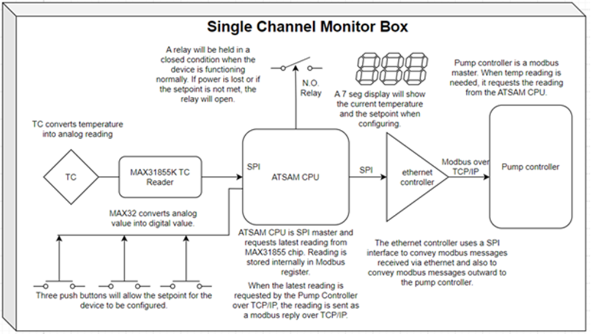

# SAM: Single Channel Temperature Monitor  

## Overview

**SAM** (Single-channel Analog Monitor) is a low-cost temperature monitor designed to enable simple temperature monitoring on a variety of TMS heaters. It continuously measures temperature using a Type K thermocouple and alerts operators when the temperature drops below a configured setpoint. The goal is to provide an inexpensive, accurate, and user-friendly thermal monitoring system suitable for industrial or laboratory environments.

## Features
- **Single-channel thermocouple monitoring** via MAX31855K  
- **Configurable setpoint** through a simple 3-button interface (Up, Down, Set)  
- **Real-time temperature display** on a 3-digit seven-segment display  
- **Alert relay output** (N.O. relay circuit) to notify external systems of low-temperature conditions  
- **Modbus TCP/IP server** for remote data retrieval  
- **Web and FTP interfaces** for configuration and resource management  
- **Persistent settings** stored in eMMC non-volatile memory  
- **FreeRTOS-based firmware** using Microchip Studio and ASF (Atmel Software Framework)  

## Hardware Architecture
### Microcontroller
- **MCU Family:** ATSAM4S (ARM Cortex-M4, 120 MHz)  
- **Development Kit:** ATSAM4S Xplained Pro  
- **Networking:** KSZ8851SNL Ethernet controller via SPI  
- **Persistent Storage:** eMMC module (or SD card for prototyping)  

### Sensor Interface
- **Thermocouple Interface Chip:** MAX31855K  
- Provides cold-junction compensation and interfaces with MCU using SPI.

### Display & Input
- **Display:** Three 7-segment LED modules showing real-time temperature or setpoint during configuration.  
- **Buttons:**  
  - **Set:** Enter/exit configuration mode.  
  - **Up/Down:** Adjust setpoint during configuration.  
- **User Feedback:** Flashing display while adjusting setpoint.  

### Relay Output
- **Type:** Normally Open (N.O.) relay  
- **Behavior:**  
  - **High signal:** Normal operation  
  - **Low signal:** Setpoint violation or sensor/power fault  

## Software Architecture
### Operating System
- **RTOS:** FreeRTOS  
- **Language:** C  
- **IDE:** Microchip Studio (Atmel Studio)  

### Modules
#### 1. Temperature Reading
- SPI-based data acquisition from MAX31855K every millisecond for 2 seconds.  
- Average of readings computed for noise reduction.  
- Filtered temperature sent to display, setpoint, and relay tasks.  

#### 2. TCP/IP Stack & Networking
- Based on FreeRTOS+TCP.  
- Includes Ethernet MAC/PHY driver for KSZ8851SNL.  
- Network settings configurable via embedded web server.  

#### 3. Web & FTP Server
- Web interface for IP configuration and device setup.  
- FTP server for uploading web resources (HTML, JS, CSS) stored in eMMC.  

#### 4. Modbus Server
- Implements **Modbus TCP** using the FreeModbus library.  
- Stores current temperature in input register (prototype uses register `1000`).  
- Allows master devices to read temperature remotely.  

#### 5. User Interface Tasks
- **Button Handler:** Interrupt-driven; sends events to state machine task.  
- **Display Driver:** Updates 7-segment display according to operating mode.  
- **Setpoint Task:** Handles setpoint logic, relay control, and NVM storage.  

#### 6. Non-Volatile Memory
- Stores:  
  - Last known setpoint  
  - Network configuration  
  - Web/FTP server resources  
- Implemented with eMMC interface.  

## Development Environment
- **Hardware:** ATSAM4S Xplained Pro + Ethernet1 Xplained Pro extension board  
- **Software:**  
  - Microchip Studio (formerly Atmel Studio)  
  - FreeRTOS  
  - ASF (Atmel Software Framework)  
  - FreeModbus library  

## Prototyping Notes
- SD card may be used as a temporary stand-in for eMMC.  
- Ensure MAX31855K wiring minimizes stray capacitance for accuracy.  
- Software debouncing implemented for all buttons (no hardware debouncing required).  
- Recommended MCU RAM: **≥128kB** (prototype uses 160kB).   

## License
This project is not licensed for redistribution or modification.  
All rights reserved © 2025 Giselle Dockterburke.

## Authors
Software Developed by Giselle Dockterburke at the Hillsboro PC in collaboration with Div Tummala who designed the hardware configuration.

---

**Revision History:**  
See the full svn revision history in the documentation folder.

---

